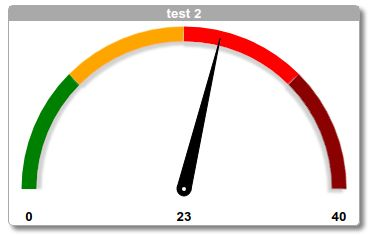

# Gaugev13
This component builds a Gauge or VU-meter using Scalable Vector Graphics. The current value is indicated
using a customisable needle.

# Features
* The arc of the VU-meter can have multiple parts in different colors.
* optional shadow of needle and arc-parts
* caption and footer
* optional labels for current value (center) and minimal/maximal values
* optional extra class to direct styling (using `:host ::ng-deep`)
* needle will use animation when value is changed (using ease-in-out schema) with customisable delay
* optional margins for top/bottom/sides
* needle size can be adjusted
* use percentage between 0 and 100 as a needle value instead of absolute values
* guards against impossible values (null, undefined, out of range)

# Documentation
Documentation is generated using Compodoc. 

## Angular info
This project was generated with [Angular CLI](https://github.com/angular/angular-cli) version 12.2.17.
